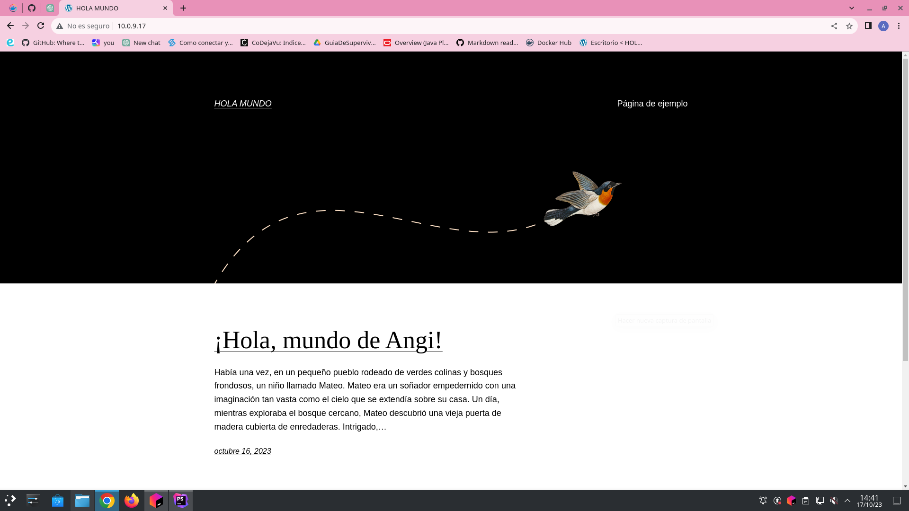

# WORDPRESS - DOCKER

## Pasos para Instalación de Wordpress con docker-compose
1. Buscar la información de wordpress en https://docs.docker.com/samples/wordpress/ <br>y seleccionar **Compose and WordPress** y nos va a dirigir a <br>https://github.com/docker/awesome-compose/tree/master/official-documentation-samples/wordpress/ donde tendremos la información de cómo crear el documento .yml<br><br> 
2. En el buscador de [DockerHub](https://hub.docker.com/search?q=) ingresamos Wordpress y podemos encontrar las versiones de la imagen de Wordpress.<br>Te dirige a (https://hub.docker.com/_/wordpress)<br><br>
3. Con toda la información anterior podemos crear nuestro docker-compose.yml<br><br>
4. Este archivo docker-compose.yml define dos servicios principales: db (para la base de datos) y wordpress (para el servidor web que ejecuta WordPress). A continuación, desglosaré cada sección del archivo:
* **Definición de versión:** ``version: '3'`` Esta línea especifica la versión de la sintaxis de Docker Compose que estás utilizando.
* **Definición de servicios:** ``services:`` Aquí comienza la definición de los servicios. En este caso, hay dos servicios: db y wordpress.
* **Servicio db (Base de datos):**
```
      db: 
      image: mariadb:10.6.4-focal
      command: '--default-authentication-plugin=mysql_native_password'
      volumes:
        - db_data:/var/lib/mysql
          environment:
        - MYSQL_ROOT_PASSWORD=somewordpress
        - MYSQL_DATABASE=wordpress
        - MYSQL_USER=wordpress
        - MYSQL_PASSWORD=wordpress
      expose:
        - 3306
        - 33060
``` 
**image:** Especifica la imagen de MariaDB y la versión a utilizar.<br>
**command:** Define el comando que se ejecutará al iniciar el contenedor. En este caso, se establece el plugin de autenticación por defecto.<br>
**volumes:** Monta un volumen para persistir los datos de la base de datos.<br>
**environment:** Define las variables de entorno para la configuración de MariaDB.<br>
**expose:** Expone los puertos 3306 y 33060 del contenedor.

* **Servicio wordpress:**
```
  wordpress:
  image: wordpress:latest
  volumes:
    - wp_data:/var/www/html
  ports:
    - 80:80
  environment:
    - WORDPRESS_DB_HOST=db
    - WORDPRESS_DB_USER=wordpress
    - WORDPRESS_DB_PASSWORD=wordpress
    - WORDPRESS_DB_NAME=wordpress
```
**image:** Especifica la imagen de WordPress y la versión a utilizar.<br>
**volumes:** Monta un volumen para persistir los datos de WordPress.<br>
**ports:** Expone el puerto 80 del host al puerto 80 del contenedor.<br>
**environment:** Define las variables de entorno para la configuración de WordPress, incluyendo la información de conexión a la base de datos.<br>

* **Definición de volúmenes:**
```
volumes:
  db_data:
  wp_data:
```
Aquí se definen los volúmenes db_data y wp_data que fueron utilizados en los servicios db y wordpress, respectivamente.

5. Para lanzarlo en la terminal se escribe el siguiente comando:
    ``docker compose up -d``
<br><br>
6. Para probarlo se debe colocar en el buscador web: localhost:80 o mi ip (http://10.0.9.17:80)

<br><br>
*Recuerda que para entrar a Wordpress como administrador debes colocar en el buscador web:<br>
http://localhost:80/wp-admin*

## Ejemplo:
